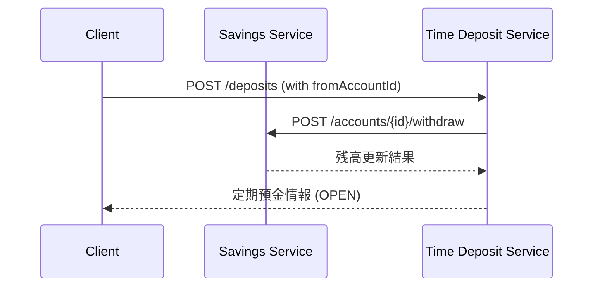
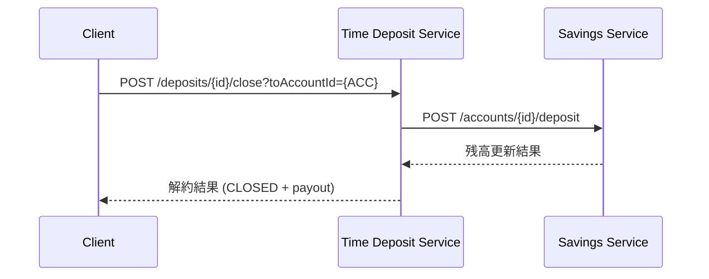

# Spring Deposit Bank App

このプロジェクトは **普通預金サービス (savings-service)** と **定期預金サービス (time-deposit-service)** の 2 つのマイクロサービスで構成される、シンプルな銀行アプリケーションです。  
Spring Boot + PostgreSQL + Docker Compose を利用して構築されています。

---

## アーキテクチャ

```mermaid
flowchart LR
  subgraph Savings Service
    SVC1[REST API :8081]
    DB1[(savings-db)]
  end

  subgraph Time Deposit Service
    SVC2[REST API :8082]
    DB2[(timedeposit-db)]
  end

  SVC1 <--> DB1
  SVC2 <--> DB2

  SVC1 <-->|内部API呼び出し| SVC2
````

* `savings-service` : 普通預金の口座管理
* `time-deposit-service` : 定期預金の管理
* 各サービスごとに独立した DB(PostgreSQL) を持つ
* サービス間通信は REST API による連携

---

## 主な機能

### 普通預金サービス (savings-service)

* 口座作成
* 入金 / 出金
* 残高照会

### 定期預金サービス (time-deposit-service)

* 定期預金作成

  * `fromAccountId` を指定すると、普通預金から元本を引落とし
* 満期日・利息計算
* 解約

  * `toAccountId` を指定すると、解約金（元本＋利息）を普通預金へ自動振替

---

## API仕様

### 1. 普通預金サービス

#### 口座作成

```http
POST /accounts
Content-Type: application/json
{
  "owner": "Taro"
}
```

レスポンス例:

```json
{
  "id": "fc8f799b-2ec9-4ce9-b946-c4fd14f5796c",
  "owner": "Taro",
  "balance": 0,
  "createdAt": "2025-08-17T11:53:18.686964Z"
}
```

#### 入金

```http
POST /accounts/{accountId}/deposit
Content-Type: application/json
{
  "amount": 20000
}
```

レスポンス例:

```json
{
  "id": "fc8f799b-2ec9-4ce9-b946-c4fd14f5796c",
  "balance": 20000.00
}
```

---

### 2. 定期預金サービス

#### 定期預金作成（普通から引落しあり）

```http
POST /deposits
Content-Type: application/json
{
  "owner": "Hanako",
  "principal": 10000,
  "annualRate": 0.015,
  "termDays": 30,
  "fromAccountId": "fc8f799b-2ec9-4ce9-b946-c4fd14f5796c"
}
```

レスポンス例:

```json
{
  "id": "dc8bee77-72b7-4e2c-baaf-aacb6c0a2234",
  "principal": 10000.00,
  "annualRate": 0.015,
  "maturityDate": "2025-09-16T11:56:00.202Z",
  "status": "OPEN",
  "owner": "Hanako",
  "termDays": 30,
  "startAt": "2025-08-17T11:56:00.202Z"
}
```

#### 満期解約（普通へ自動振替）

```http
POST /deposits/{depositId}/close?toAccountId={accountId}&at={ISO8601_DATETIME}
```

レスポンス例:

```json
{
  "payout": 10012.33,
  "status": "CLOSED",
  "id": "dc8bee77-72b7-4e2c-baaf-aacb6c0a2234",
  "toAccountId": "fc8f799b-2ec9-4ce9-b946-c4fd14f5796c"
}
```

---

## シーケンス図

### 定期預金作成（普通→定期振替あり）



### 満期解約（定期→普通振替）



---

## 動作確認スクリプト

### test-transfer.sh

1. 普通口座を作成
2. 入金
3. 定期作成（普通から引落し）
4. 強制的に満期にする（DB 更新）
5. 解約（普通へ自動振替）
6. 残高と定期ステータスを検証

```bash
bash test-transfer.sh
```

---

## 起動方法

```bash
docker compose build --no-cache
docker compose up -d
```

* savings-service: [http://localhost:8081](http://localhost:8081)
* time-deposit-service: [http://localhost:8082](http://localhost:8082)

```

---

